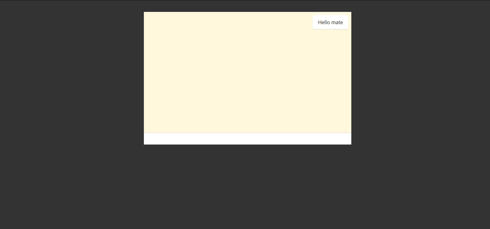
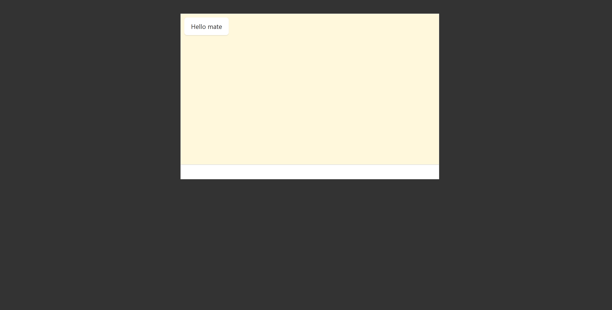

# Getting Started with Create React App

This project was bootstrapped with [Create React App](https://github.com/facebook/create-react-app).

# Available package that you need to install
---
Redis-cli
```
  Firstly you need to install redis client on your computer you can download it from the link below.
  https://github.com/MicrosoftArchive/redis/releases

  After donwload it you must run and check it from cmd.
  redis-cli
```
---
Feed scroll
```
  npm install react-scrollable-feed
```
---
Backend
```
  you need to run and connect to backend for running this app before you do.
  you should in backend while running that npm and install package in backend folder. Like c/sssproject/backend> npm i package

  npm install package

  after install package you can run-up backend \

  npm run dev
```

# ScreenShots


---


## Available Scripts

In the project directory, you can run:

### `npm start`

Runs the app in the development mode.\
Open [http://localhost:3000](http://localhost:3000) to view it in your browser.

The page will reload when you make changes.\
You may also see any lint errors in the console.


